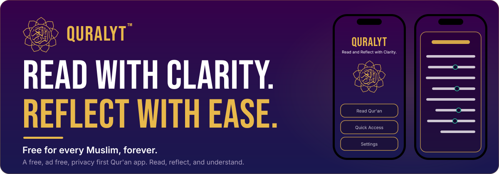
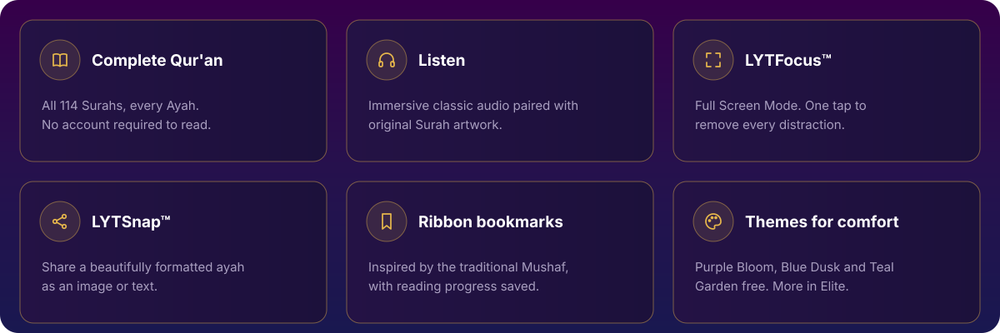
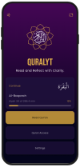
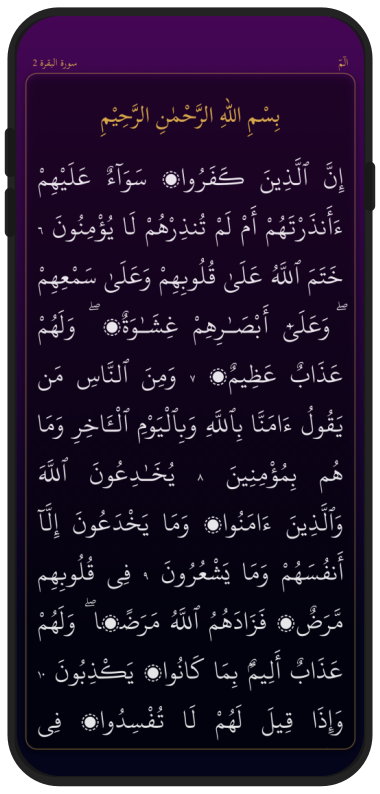
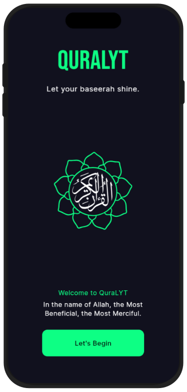

 

[**About**](#about) &nbsp;·&nbsp; [**Design**](#design-system) &nbsp;·&nbsp; [**Features**](#reading-experience) &nbsp;·&nbsp; [**Roadmap**](#roadmap) &nbsp;·&nbsp; [**Screenshots**](#screenshots) &nbsp;·&nbsp; [**Community**](#community)

 

**QuraLYT** is a free, ad free, privacy first Qur'an app. The Noble Qur'an, read, reflect, and understand, free for every Muslim, forever.

*This repository is the documentation hub for QuraLYT: its philosophy, design system, accessibility principles, and long term roadmap, alongside the app itself.*

> [!NOTE]
> **Current status.** QuraLYT is in active development, built by one person with no investors and no advertising. The design system and user interface are largely complete, and current work is focused on application logic, authenticated resource integration, feature implementation, and testing. I am also in contact with respected organizations and content providers to make sure Qur'an text, translations, audio, and other resources are authentic, properly licensed, and accurately attributed before public release.
>
> Not yet available on Google Play or the App Store. Coming soon, In sha Allah.

 

## About

QuraLYT is a Qur'an platform created to help Muslims build a deeper connection with the words of Allah through a calm, respectful, distraction free experience. Every screen, interaction, and feature is designed to reduce digital noise and make reading, listening, learning, and reflecting feel natural and peaceful.

QuraLYT was never created to compete. It was created to serve.

> *To create a calm, respectful, and accessible Qur'an platform that helps people read, learn, and reflect with clarity.*

### Why QuraLYT exists

Many Qur'an apps are cluttered with ads, subscriptions, and data collection. I asked a different question: instead of what feature should be built next, how can reading the Noble Qur'an become calmer, clearer, more accessible, and more dignified for every Muslim.

| Every decision begins with that question | |
| :--- | :--- |
| Accessibility at the core, not added afterward | No advertising, ever |
| Privacy by design, before profiling | No tracking, ever |
| Clarity before complexity | Built for everyone, not just the technically confident |
| Community focused development, shaped by feedback rather than analytics | |

### Who QuraLYT is for

QuraLYT is designed to be welcoming to the entire Ummah, across different ages, abilities, levels of experience, and backgrounds.

| | |
| :--- | :--- |
| **Lifelong Muslims** Whether reading for the first time or the thousandth. | **New Muslims and those returning to Islam** No assumptions, no confusion, and clear guidance from the very first screen. |
| **Children learning with family** In homes, mosques, and schools. | **Anyone overwhelmed by existing Qur'an apps** Cluttered menus, ads, and unclear navigation were never meant to stand between a reader and the Qur'an. |

 

## A Personal Note

> QuraLYT has been crafted by one person, one step at a time, over many years. Every screen, every feature, every decision, and every challenge has been part of a journey driven by a simple intention: to create a Qur'an platform that serves the Ummah with sincerity, respect, and excellence.
>
> It has not always been easy. Like many long term projects built independently, there have been setbacks, difficult choices, and moments where progress felt almost impossible. Yet, by the mercy of Allah, QuraLYT continued to grow.
>
> Today, the foundation is in place.
>
> The vision, however, is far greater than what one person can accomplish alone.
>
> To bring QuraLYT to Muslims around the world, I believe it now needs the knowledge, experience, and support of the Ummah. Whether through scholarship, accessibility expertise, translations, development, design, testing, or simply sincere feedback, every contribution can help make QuraLYT better for everyone.
>
> I pray that this project becomes a lasting source of benefit, a means of bringing people closer to the Qur'an, and a form of sadaqah jariyah for everyone who helps it grow.
>
> QuraLYT is a project of LYTDesign™, based in Norway, but it is built and maintained by one person, not a company or a team.

 

## Design System

QuraLYT's interface is built on a **box based cognitive UI system**, the same underlying design language LYTDesign applies across its ecosystem. Within QuraLYT specifically, this system is branded **LYTGrid™**.

Most apps bury features behind menus, tabs, and nested navigation, forcing the reader to remember where something lives instead of just seeing it. LYTGrid takes a different approach: every feature gets its own dedicated, visible space on screen. Nothing is hidden, nothing is nested more than one layer deep, and the reader never has to hold navigation logic in their head while trying to focus on the Qur'an.

| Reduced cognitive load | Consistency for elderly and neurodivergent readers | Clarity over depth |
| :--- | :--- | :--- |
| Predictable, single-purpose boxes mean less mental effort spent figuring out the interface itself. | The same interaction pattern repeats everywhere, so once it is learned once, it is learned everywhere. | Where possible, important actions remain visible rather than being buried in deep navigation. |

LYTGrid began as QuraLYT's interface system. The long term intent is for it to grow into a reusable design system across LYTDesign's wider product line, not remain specific to one app.

Within that system, QuraLYT's visual language is built to feel close to the traditional **Mushaf** while remaining fully modern in interaction and structure:

- **Mushaf inspired reading experience:** ribbon style bookmarks, respectful page rhythm, and typography chosen to feel familiar and dignified, not like a generic app rebuilt around the Qur'an
- **Calm reading:** nothing on screen fights for attention that shouldn't
- **Respectful motion:** transitions and interactions are quiet and purposeful, never playful or attention seeking
- **Typography:** Arabic script with full diacritics, sized and spaced for genuinely long reading sessions
- **Surah artwork:** every Surah is paired with original illustration, created to encourage reflection while remaining respectful of the Qur'an, modern in style without ever distracting from the text itself

 

## Reading Experience

*What QuraLYT is built to offer:*

 

- Complete Qur'an, all 114 Surahs, every Ayah
- **LYTFocus™:** Full Screen Mode, one tap to remove every distraction
- Ribbon style bookmarks, inspired by the traditional Mushaf, with reading progress saved
- 114 original Surah illustrations throughout the app
- Immersive classic audio, paired with original Surah artwork for a unique listening atmosphere
- No account required to read the Qur'an

### Learning & Reflection

- **LYTTouch™:** touch and hold contextual help, right on screen, so features are discovered naturally instead of through manuals or help pages
- **LYTSnap™:** a single tap to share a beautifully formatted ayah as an image or text, or continue into deeper reflection tools
- Video reflections paired with Surah listening, showing the artwork and atmosphere created for each Surah
- AI reflections and AI advanced search *(planned)*, to help readers find verses, topics, and deeper meaning through natural language

 

## Accessibility

Accessibility has guided QuraLYT from the beginning, not as a feature added later. Every screen is designed to be clear, calm, readable, and easy to navigate for as many people as possible. I continue to improve accessibility throughout development, with the goal of aligning with **WCAG 2.2 AA**.

This is also part of why the interface is built on LYTGrid: predictable, single-purpose boxes reduce the mental effort needed just to operate the app, which matters as much for accessibility as it does for calm reading.

*Formal compliance badges will only be published once independently audited. I do not want to overclaim accessibility before it is verified.*

 

## Platform Vision

QuraLYT is designed to work offline wherever possible. This is a **local first** philosophy: your reading activity doesn't need to touch a server to happen, the Qur'an should be readable without depending on an internet connection, and not every reader has consistent connectivity.

Beyond phone support today, the platform vision includes:

| | |
| :--- | :--- |
| **Tablet support** A true tablet layout built for larger screens. | **Android TV support** Bringing the Qur'an to a shared screen for families and gatherings. |
| **Car support, through LYTDash™ Mode** A landscape, glance friendly dashboard designed for car displays and hands free listening. | **Multi user profiles** One Elite subscription for the whole family, with separate bookmarks, progress, and preferences. |
| **Cloud backup** Securely syncing bookmarks, notes, and reading progress across personal devices. | |

 

## Future Ecosystem

**QuraVision™** is QuraLYT's long term vision beyond reading and listening: a guided understanding ecosystem meant to help readers go deeper with the Qur'an through reflection, learning, and intelligent guidance, without ever replacing the text itself or a qualified scholar. It is not built yet. These are long term commitments guiding where QuraLYT is heading, shared openly so nothing here is mistaken for something available today:

- **QLES™** (reflective AI support): intended to help a reader sit with a verse a little longer, offering gentle, context aware prompts for reflection rather than answers or interpretation
- **QLIS™** (Islamic guidance AI): intended to help a reader find relevant Islamic learning material, such as related guides or topics, without replacing scholarly advice
- Illustrated Hadith collection, with clear explanations and optional audio
- Illustrated Islamic guides covering prayer, Hajj, Umrah, Ramadan, and everyday learning
- Prayer times by LYTDesign

 

## Trust & Authenticity

Every Qur'an text, translation, audio recitation, and future tafsir resource is selected with authenticity, proper licensing, and scholarly attribution in mind. Translations displayed in QuraLYT are translations of the meaning, not the divine word itself, and are clearly credited to their translators throughout the app. The Arabic text remains the primary source at all times.

 

## Free, Pro & Elite

QuraLYT is built on a simple promise: the core Qur'an experience will always remain free. Every Muslim should be able to read, listen to, and reflect on the Qur'an without advertising, mandatory subscriptions, or locked essential features.

For readers who want to go beyond a conventional Qur'an app, QuraLYT also offers optional Pro and Elite experiences. These are not about restricting access to the Qur'an. They are about expanding how people can engage with it, through additional personalization, enhanced reading environments, cross device experiences, and future features that help different readers connect with the Qur'an in ways that suit them.

Elite represents QuraLYT's long term premium experience: the full set of premium themes, cloud backup across devices, multi user family profiles, and the platform capabilities planned for tablet, TV, and car use. It is intended for readers and families who want the most complete version of QuraLYT, while the core reading experience remains exactly as free as it is for everyone else.

By choosing Pro or Elite, readers also help support the continued development of the free core experience, new translations, accessibility improvements, and long term maintenance for the benefit of the Ummah.

 

## Themes

QuraLYT's themes were never created to show off colours or make the app look modern. They were designed as part of the reading experience itself.

The environment around us influences how comfortable it feels to spend time reading. A quiet evening, an early morning, or a bright afternoon each create a different atmosphere. QuraLYT's themes are carefully crafted to complement those moments, helping create a calm and comfortable space for reading, reflection, and listening.

*Modern design should never compete with the Qur'an. It should quietly support it.*

| Tier | Themes |
| :--- | :--- |
| **Core (Free)** | Purple Bloom (default), Blue Dusk, Teal Garden |
| **Elite** | Verdant Serenity, Velvet Night, Crimson Tide, Amber Night, Obsidian Flame, Royal Veil |

Special reading modes include Full Screen Mode, Quiet Mode, Child Mode, Elderly Mode, and Dash Mode, each designed for a different reading situation.

 

## Languages

**Initial languages:** Arabic, English, Urdu, Turkish, Indonesian

**Long term vision, underserved languages, future phases:** Fulfulde, Bambara, Wolof, Mooré, Igbo, Mandinka, Lingala, Dinka, Tigrinya, and more planned.

Many of these languages have little or no Qur'an resources available today. This is a long term project depending on scholars, translators, voice artists, and the support of the Ummah, and it will take years to unfold gradually, language by language. Every translation is labeled as a translation of the meaning, with the translator credited.

 

## Roadmap

| Stage | Status |
| :--- | :--- |
| Core UI design system | ✅ Done |
| Responsive layouts (phone, tablet, desktop) | ✅ Done |
| Application logic and feature implementation | 🔄 In progress |
| Resource integration and testing | 🔄 In progress |
| Public beta | ⏳ Planned |
| Version 1 release | ⏳ Planned |
| Expanded translations and learning features | ⏳ Planned |

*Planned documentation as the project matures: architecture overview, accessibility audit results, API references, contribution guides, and a changelog, all within this repository.*

 

## Screenshots

<table>
<tr>
<td width="25%" align="center"></td>
<td width="25%" align="center"></td>
<td width="25%" align="center"></td>
<td width="25%" align="center"></td>
</tr>
<tr>
<td align="center"><b>Home</b> The entry point into QuraLYT</td>
<td align="center"><b>Reading</b> Calm, distraction free reading</td>
<td align="center"><b>Themes</b> Stunning palettes for longer sessions</td>
<td align="center"><b>Media Player</b> Peaceful listning of the Qur'an</td>
</tr>
</table>

*For more screenshots and live demo videos of QuraLYT in action, visit [quralyt.com](https://quralyt.com).*

 

## Our Promise

| | |
| :--- | :--- |
| Free core Qur'an reading, forever. | No advertising. |
| No tracking. | Respect for the Noble Qur'an. |
| Accessibility from the beginning, not as an afterthought. | Authentic resources with proper licensing and attribution. |

 

## Community

QuraLYT is currently in active development, and there are several ways to get involved as the project grows:

| | |
| :--- | :--- |
| **Translation reviewers** Helping verify accuracy and quality of translations. | **Accessibility testers** Feedback from readers with different needs, devices, and reading preferences. |
| **Scholars** Guidance on Qur'an data, tafsir, and translation labeling. | **Designers** Feedback on theming, artwork, and interaction design. |
| **Developers** Future contributions as the codebase matures. | |

If any of this resonates with you, please reach out via [info@quralyt.com](mailto:info@quralyt.com).

 

## Support QuraLYT

QuraLYT is built as a long term project to serve the Muslim Ummah through a free, ad free, and privacy first Qur'an experience.

There are no investors, no advertising, and no user profiling. If you would like to help support continued development, accessibility improvements, translations, and maintenance, your support is greatly appreciated and always voluntary. The core Qur'an reading experience will remain free for everyone, In sha Allah.

[**Support →**](https://quralyt.com/support.html) &nbsp;·&nbsp; [**Ko-fi →**](https://ko-fi.com/quralyt) &nbsp;·&nbsp; [**Instagram →**](https://www.instagram.com/quralyt/) &nbsp;·&nbsp; [**quralyt.com →**](https://quralyt.com)

 

## License

Qur'an text, translations, audio, and other Islamic resources are used in accordance with their respective licenses and attribution requirements. Content and translations are used under scholarly guidance and are labeled accordingly. App source licensing details will be finalized closer to public release.

## Credits

Built with the intention of sadaqah jariyah, for the Ummah, In sha Allah.

*Organizations whose licensed resources help make QuraLYT possible will be formally acknowledged here once permissions and licensing are confirmed, named individually alongside the specific resource they provide, such as Qur'an text, translation, or audio recitation, rather than listed by name alone.*

 

**QuraLYT™** · Read with Clarity. Reflect with Ease. 
A project of <a href="https://www.lytdesign.com">LYTDesign™</a>, Norway. Built with sincerity for the Ummah, In sha Allah.

